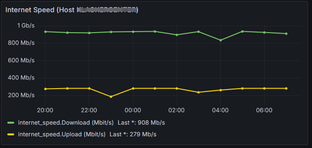

# Production Setup: Internet-Speed Monitoring with InfluxDB & Grafana

Dieses Repository enthält alles, was zum produktiven Setup mit Docker-Compose notwendig ist:

- **InfluxDB 2.7.9** & **Grafana** in Containern  
- **Ookla Speedtest CLI** Installation  
- **Shell-Skript** zum regelmäßigen Erfassen der Speedtests  
- **Cron-Job** für automatisierte Ausführung  
- **Grafana-Dashboard** mit Queries für Download & Upload

---

## Projektstruktur

```

production-setup/
├── .env\_example
├── docker-compose.yml
├── scripts/
│   ├── install\_speedtest\_cli.sh
│   └── speedtest-monitor.sh
├── cron/
│   └── speedtest-cron
└── README.md

````

---

## 1. .env konfigurieren

Kopiere die Beispiel-Datei und passe sie an:

```bash
cp .env_example .env
````

**`.env`** (Beispiel):

```dotenv
# Bind-Mount Paths
BIND_INFLUXDB_DATA=/opt/influxdb/data
BIND_GRAFANA_DATA=/opt/grafana/data

# InfluxDB
INFLUXDB_INIT_USERNAME=admin
INFLUXDB_INIT_PASSWORD=YourStrongInfluxPassword
INFLUXDB_INIT_ORG=production
INFLUXDB_INIT_BUCKET=internet_speed
INFLUXDB_INIT_RETENTION=720h
INFLUXDB_INIT_ADMIN_TOKEN=SuperSecureToken
INFLUXDB_PORT=8086

# Grafana
GRAFANA_ADMIN_PASSWORD=YourStrongGrafanaPassword
GRAFANA_ROOT_URL=http://localhost:3100
GRAFANA_HTTP_PORT=3100
```

---

## 2. Docker-Compose starten

```bash
docker-compose up -d
```

* **InfluxDB** auf Port `${INFLUXDB_PORT}`
* **Grafana** auf Port `${GRAFANA_HTTP_PORT}`

Prüfe Status:

```bash
docker-compose ps
docker-compose logs influxdb --tail=20
docker-compose logs grafana --tail=20
```

---

## 3. Speedtest CLI installieren

```bash
chmod +x scripts/install_speedtest_cli.sh
./scripts/install_speedtest_cli.sh
```

---

## 4. Monitoring-Skript testen

```bash
chmod +x scripts/speedtest-monitor.sh
./scripts/speedtest-monitor.sh
```

* Bei Erfolg: kein Fehler, HTTP-Status `204` in der Ausgabe.
* InfluxDB CLI prüfen:

  ```bash
  docker exec influxdb influx bucket list \
    --org production \
    --host http://localhost:${INFLUXDB_PORT} \
    --token SuperSecureToken

  docker exec influxdb influx query \
    --org production \
    --host http://localhost:${INFLUXDB_PORT} \
    --token SuperSecureToken \
    --raw 'from(bucket:"internet_speed") |> range(start:-1h) |> limit(n:5)'
  ```

---

## 5. Cron-Job einrichten

Datei `cron/speedtest-cron`:

```cron
# Internet-Speedtest Cron-Jobs

# Kritisch (stündlich) – aktivieren bei Bedarf
#0 * * * * /usr/bin/env bash /opt/production-setup/scripts/speedtest-monitor.sh >> /var/log/speedtest-monitor.log 2>&1

# Normalbetrieb (alle 4 Stunden)
0 */4 * * * /usr/bin/env bash /opt/production-setup/scripts/speedtest-monitor.sh >> /var/log/speedtest-monitor.log 2>&1
```

Installieren:

```bash
sudo crontab cron/speedtest-cron
sudo systemctl restart cron
```

Logs:

```bash
tail -f /var/log/speedtest-monitor.log
```

---

## 6. Grafana Setup

### 6.1 Data Source

1. **Grafana öffnen**
   `http://<host>:${GRAFANA_HTTP_PORT}`
   Login: `admin` / `${GRAFANA_ADMIN_PASSWORD}`

2. **Add data source → InfluxDB**

   * **URL**: `http://influxdb:${INFLUXDB_PORT}`
   * **Organization**: `production`
   * **Bucket**: `internet_speed`
   * **Token**: `${INFLUXDB_INIT_ADMIN_TOKEN}`
   * **HTTP Method**: `POST`

3. **Save & test** → “Data source is working”

---

### 6.2 Dashboard anlegen

1. **Create → Dashboard → Add new panel**

2. **Queries** (InfluxQL):

   **Query A (Download):**

   ```sql
   SELECT
     mean("download") AS "Download (Mbit/s)"
   FROM "internet_speed"
   WHERE $timeFilter
   GROUP BY time($__interval) fill(null)
   ```

   **Query B (Upload):**

   ```sql
   SELECT
     mean("upload") AS "Upload (Mbit/s)"
   FROM "internet_speed"
   WHERE $timeFilter
   GROUP BY time($__interval) fill(null)
   ```

3. **Visualization**

   * **Chart Type**: Time series
   * **Line width**: z.B. 2
   * **Show points**: Never
   * **Null value**: Connected

4. **Legend**

   * **Display name** aus den Aliases (“Download (Mbit/s)”, “Upload (Mbit/s)”)
   * Separate Y-Achsen (optional): Override für Upload auf rechte Achse

5. **Time range**
   Oben rechts z.B. “Last 24 hours” oder “Last 7 days”

6. **Save Dashboard**

   * Name: `Internet Speed Overview`
   * Folder: `Monitoring`

**Beispiel**


---

## 7. Backup & Restore

### 7.1 InfluxDB-Backup (Host ➔ Container)

**Auf Test-Host:**

```bash
mkdir ~/influx-backup
influxd backup --portable ~/influx-backup
scp -r ~/influx-backup prod:/opt/production-setup/influx-backup
```

**Im Production-Container:**

```bash
docker cp influx-backup influxdb:/tmp/influx-backup
docker exec influxdb influx restore --full /tmp/influx-backup
docker exec influxdb rm -rf /tmp/influx-backup
```

### 7.2 Grafana-Dashboard Export/Import

**Export (Test):**

```bash
curl -s -u admin:YourPass \
  http://test-host:3100/api/dashboards/uid/<UID> \
  -o dashboard.json

jq '{dashboard: .dashboard, overwrite: true}' dashboard.json > to_import.json
```

**Import (Prod):**

```bash
curl -s -u admin:${GRAFANA_ADMIN_PASSWORD} \
  -H "Content-Type: application/json" \
  -X POST http://prod-host:3100/api/dashboards/db \
  -d @to_import.json
```

---

## 8. Zusammenfassung

1. `.env` anlegen & anpassen
2. `docker-compose up -d`
3. Speedtest CLI installieren
4. Skript testen & Cron-Job aktivieren
5. Grafana Data Source & Dashboard mit finalen Queries konfigurieren
6. Backup/Restore bei Bedarf nutzen

Damit hast du ein vollständiges, versioniertes Production-Setup für dein Internet-Speed Monitoring mit InfluxDB und Grafana. Viel Erfolg!
